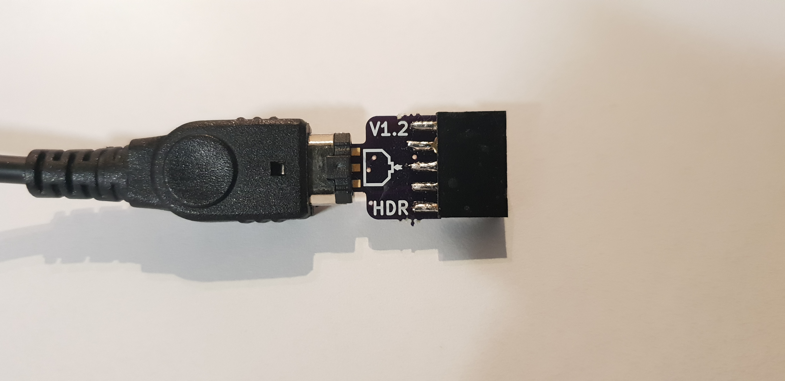

# GBPrinter-Emulator-Kit-Minimal
Based on BennVenn's DIY [Gameboy printer emulator Kit](https://bennvenn.myshopify.com/products/gameboy-printer-emulator-kit) & [Palmr's gb-link-cable-breakout](https://github.com/Palmr/gb-link-cable)
 
 
 
 
 
 
 
 

Boards are 1.6mm

## BOM:

Gameboy link cable

2x5 female 2.54mm pitch dual row header / Or solder the stlink header to the board

Modified STlink Dongle

## Usage:

NOTE: on V1.2 boards the indicator for cable direction is wrong, up on the board corresponds with up on the cable.

Short pads marked "1" for normal operation

Short pads marked "2" to invert Data in & Data Out

Software & Firmware can be found on [Bennvenn's website](https://bennvenn.myshopify.com/products/gameboy-printer-emulator-kit)
