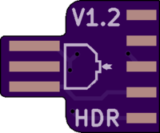
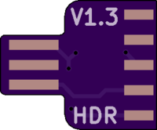
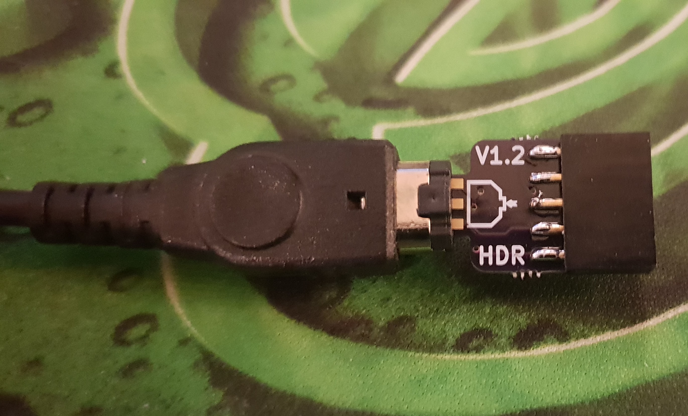

# GBPrinter-Emulator-Kit-Minimal

Based on BennVenn's DIY [Gameboy printer emulator Kit](https://bennvenn.myshopify.com/products/gameboy-printer-emulator-kit) & [Palmr's gb-link-cable-breakout](https://github.com/Palmr/gb-link-cable)
 
 
 
 
 
 
 
 

Boards are 1.6mm

## BOM:

Gameboy link cable

2x5 female 2.54mm pitch dual row header

Modified STlink Dongle

**Usage: **

Short pads marked "1" for normal operation

Short pads marked "2" to invert Data in & Data Out

Software & Firmware can be found on [Bennvenn's website](https://bennvenn.myshopify.com/products/gameboy-printer-emulator-kit)
